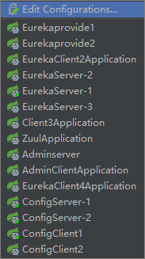

# Spring Cloud 

Author : **[Janloong Do_O](https://blog.csdn.net/du807110586)** | **<a href ="mailto: janloongdoo@gmail.com">Email</a>**

> 个人微服务框架学习,持续学习中(现阶段功能以模块化测试学习接入为主,后期针对生产环境测试改造)……

> 项目中除了基础的spring cloud 组件之外,集成了第三方 **[spring boot admin](https://github.com/codecentric/spring-boot-admin)** 可视化管理组件

    
    相关环境： 
    idea 2018.3.6
    jdk 11
    springboot 2.1.3.release
    springcloud Greenwich.RELEASE
    springbootadmin 2.1.3
    
## update 
    升级版本，并以测试状态整合入spring cloud security oauth2 ...

## 模块描述

|模块|描述|端口|多配置|集成说明|
|:---|:---|:---|:---|:---|
|admin-client|admin客户端 - 官方配置方式 |8890|-|这个是admin官方给出的一个客户端配置方式之一，里面会有比较完备的actuator实现效果，在通过discovery方式配置客户端方式的时候可以作参考|
|admin-server|admin服务端|8889|-|使用的版本2.1.3|
|auth2-center|oauth2授权鉴权中心|8080|-|集成spring cloud security oauth2|
|base-framework|基础单服务脚手架|-|-|集成常用工具类，异常处理，结果集封装,common下可提取为基础依赖供多服务使用|
|config-client |高可用配置中心客户端|8773,8893|client1,client2|配置客户端集成演示demo，生产环境已集成入各个服务之中|
|confg-repo|配置中心引用的本地文件|-|-|本地文件配置，配置中心支持多种文件配置格式,目录结构|
|config-server |高可用配置中心服务端|8888,8892|server1,server2|支持测试环境读取本地文件，生产环境支持git,svn等|
|eureka-feign |Feign方式的客户端|8766,8821(独立management端口)|-|集成hystrix,openfeign,hystrix dashboard|
|eureka-provide |服务提供者|8763,8764|provide1,provide2|普通的服务，主要用于配合测试feign,ribbon的远程调用|
|eureka-ribbon |Ribbon+rest方式的客户端|8765|-|集成hystrix,ribbon,zipkin,rabbitmq|
|eureka-server |高可用注册中心|8761,8762|server1,server2|服务注册中心，用于注册与发现其他服务|
|gateway|网关路由|8082|-|spring 的网关路由|
|spring-data-jpa|spring data jpa 的相关知识点汇总与应用|8767|-|持久层使用的jpa,包含相关方式的使用，实体的映射初步使用等9|
|zuul|网关路由|8081|-|自定义动态路由，oauth2资源服务控制|
|zipkin-server |服务追踪中心|9411|-|独立模块,官方提供的jar包直接运行即可访问，已无需开发。|
|user|用户测试|8083|-|普通微服务|

## 问题记录
> 望相互学习，多多指教

4. 使用rabbitmq作为代理的SpringCloud消息总线的时候。(该项仅仅为小规模测试记录,概率性)

   一是关于@RefreshScope的作用域问题，不能在启动类MainApplication使用，首先要满足的是在使用动态配置的地方使用该注解，该注解在bean相关的作用域依然可能会有其它问题。
   
   二是关于remote远程更新的时候，在向confingClient集群发送/bus-refresh时会出现两个主要问题：
   
    （1）在config-server集群的前提下，rabbitmq在通知整个服务更新时，config-server只从其中任意一个server开始fetch,
    另一个server静默。client是同时refresh,在访问client的时候会出现，相应属性值版本交叉的情况，测试中最多出现过3个版本的跨度问题。 
    
    （2）在/bus-refresh 未结束时,访问其中一个client, 会造成一个client成功 add property from server , 但是另一个client 会出现 cannot connect to rabbitmq 导致属性配置更新失败（可能并非必然联系，偶然出现）  
5. 从Edgware开始，Sleuth基于MQ整合Zipkin更加的简化！Spring Cloud Edgware之前的版本使用 Zipkin1.x ，要想MQ方式收集数据，需整合 spring-cloud-sleuth-stream 。而在Edgware及更高版本中，使用 Zipkin2.x。 Zipkin2.x 本身已支持基于MQ的数据收集方式，故而 spring-cloud-sleuth-stream 将被废弃

## 待办
    
    了解springcloudstream与springcloudbus的结合应用
    
## 测试访问

|功能|url|
|:---|:---|
|sba| http://localhost:8889/admin |
|rabbitmq| http://localhost:15672 |
|zipkin| http://localhost:9411 |

## Tips:
> 为方便测试，快速建立如下效果
    
    Jetbrains intelliJ IDEA
    一、可复制other文件夹下的workspace.xml 至 .idea下覆盖相应文件
    二、复制workspace.xml中configuration节点所有内容 至 相应文件的相应节点下
    

